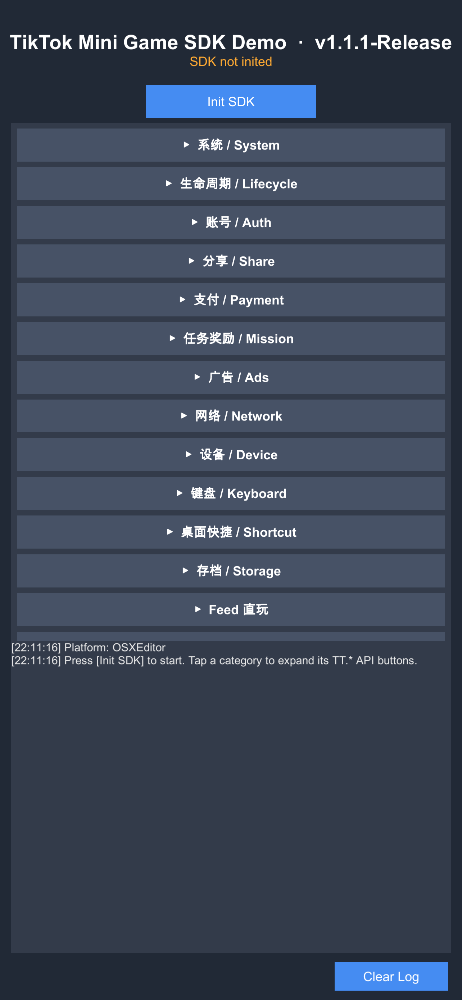
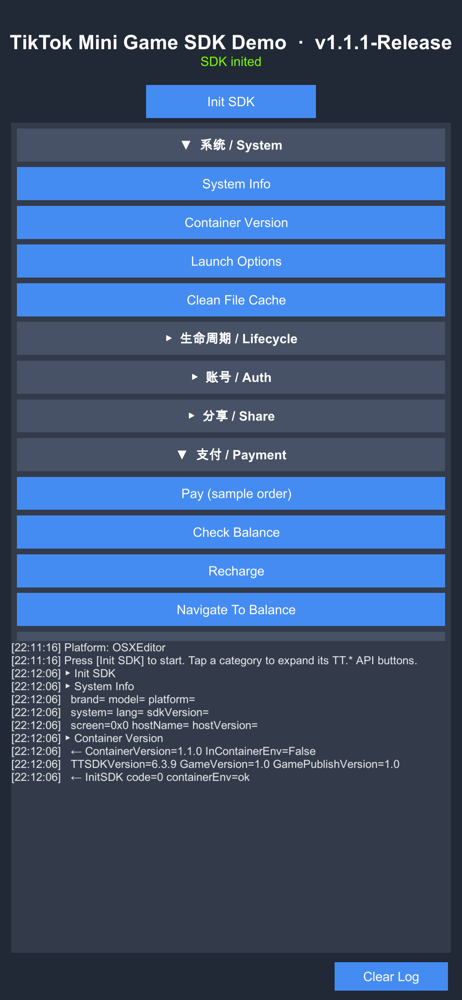

# Bordy · TikTok 小游戏

[English](README.md) · **中文**

本仓库同时包含：

1. **Bordy 逻辑谜题游戏**（太阳/月亮填格，当前可玩：新手引导 + 第一关）
2. **TikTok 小游戏 SDK 参考**（`BordyMainMenu.cs` 演示全部 `TT.*` 接口）

游戏开发说明见 **[docs/GAMEPLAY.zh.md](docs/GAMEPLAY.zh.md)** · 本阶段总结见 **[docs/PHASE-SUMMARY.md](docs/PHASE-SUMMARY.md)** · 协作见 **[docs/CONTRIBUTING.md](docs/CONTRIBUTING.md)**

---

## 游戏快速上手

```bash
git clone <本仓库>
cd Bordy
# Unity Hub → Add project → 2022.3.62f3c1
```

1. 等首次资源导入完成。
2. 菜单 **Bordy → Run Full Setup**（生成四个场景并写入 Build Settings）。
3. **Bordy → Open Home Scene**，然后 Play。
4. **开始游戏** → 关卡选择 → 完成 **新手引导**（4×4）→ 解锁 **第一关**（6×6）。

```
Home ──[开始游戏]──▶ LevelSelect ──[新手引导]──▶ Tutorial (4×4)
                              └──[第一关]──────▶ MainMenu (6×6)
```

| Build | 场景 | 说明 |
|-------|------|------|
| 0 | `Home.unity` | 入口 |
| 1 | `LevelSelect.unity` | 关卡选择 |
| 2 | `Tutorial.unity` | 新手引导 |
| 3 | `MainMenu.unity` | 第一关（历史命名，非 SDK 菜单） |

---

## TikTok SDK 参考工程

> ## 📦 SDK 下载
>
> **[⬇️ 下载 `com.tiktok.minigame@1.1.1-Release.unitypackage`](./com.tiktok.minigame@1.1.1-Release.unitypackage)** (1.6 MB)
>
> 完整的 TikTok 小游戏 SDK 已经以单个 Unity 包的形式放在本仓库根目录。
> 拖进任意 Unity 2022.3 工程即可使用，详细步骤见
> [在你自己的工程里集成 SDK](#在你自己的工程里集成-sdk)。

接入 **TikTok 小游戏 SDK（TTSDK）** 的 Unity 参考工程，按分类把每一个公开的 `TT.*` 接口
做成可点击的按钮，所有回调结果实时滚到日志面板里——既能在 Unity Editor 里跑通，也能在
抖音小游戏容器内真机调试。

| 折叠首页 | 初始化 + 调用几个接口后 |
| --- | --- |
|  |  |

---

## 仓库目录一览

| 路径 | 用途 |
| --- | --- |
| `docs/` | 游戏玩法、阶段总结、协作指南 |
| `com.tiktok.minigame@1.1.1-Release.unitypackage` | 可直接导入的 SDK 包（TTSDK v1.1.1） |
| `Assets/Plugins/com.tiktok.minigame/` | 本工程已导入的 SDK 副本 |
| `Assets/Bordy/Scripts/` | 谜题玩法：`BordyBoardController`、`BordyTutorialGuide` 等 |
| `Assets/Bordy/Scripts/BordyNav.cs` | 场景导航（主页 / 选关 / 教程 / 第一关） |
| `Assets/Bordy/Scripts/BordyMainMenu.cs` | **SDK 演示**（未挂到当前游戏场景） |
| `Assets/Bordy/Editor/` | 代码驱动场景构建 + `Run Full Setup` |
| `Assets/Bordy/Scenes/` | `Home` · `LevelSelect` · `Tutorial` · `MainMenu`（第一关） |

---

## 环境要求

- Unity **2022.3.62f3c1**（2022.3.x LTS）。**不要**使用团结引擎（Tuanjie）
  分支——SDK 的 `asmdef` 会冲突。
- TTSDK **1.1.1** 或更新版本。v1.1.1 起额外提供 `ttsdk-editor.dll`，在 Unity Editor
  内能直接走 Mock 实现，不会再抛"不支持的平台"。
- Build target：WebGL（IL2CPP）。容器只支持 WebGL。

---

> 游戏快速上手见文首 **[游戏快速上手](#游戏快速上手)**。下方为 SDK 集成与 API 演示说明。

---

## 在你自己的工程里集成 SDK

直接从本仓库拿 SDK 包：

```
./com.tiktok.minigame@1.1.1-Release.unitypackage
```

集成步骤：

1. 把 `.unitypackage` **拖进** Unity Project 窗口，或者走菜单
   **Assets → Import Package → Custom Package…** 选这个文件。
2. 导入对话框里全选（Import All）。
3. 导入后会得到：
   ```
   Assets/Plugins/com.tiktok.minigame/
     TTSDK/ttsdk.dll          ← runtime（仅 WebGL 加载）
     TTSDK/ttsdk-editor.dll   ← editor mock（仅 Editor 加载）
     Editor/ttsdk_tools.dll   ← 构建工具
     WebGL/                   ← 平台胶水代码
     LitJson/, DefaultTemplate/
   ```
4. 配置 **Player Settings**：
   - Build target：**WebGL**
   - Scripting backend：**IL2CPP**（不支持 Mono）
   - Company / product name 随意——会出现在容器 UI 里
5. 确认 PluginImporter 的平台过滤（Unity 通常会根据 `.meta` 自动设好）：
   `ttsdk.dll` 只勾 WebGL，`ttsdk-editor.dll` 只勾 Editor。

接好之后 `using TTSDK;` 就能用了。

---

## 初始化 SDK

初始化是一个异步调用。所有依赖容器的接口（Login / Pay / Ads / Share / …）都必须等
这一步成功后才能正常工作。

```csharp
using TTSDK;
using UnityEngine;

public class Boot : MonoBehaviour
{
    void Start()
    {
        TT.InitSDK((code, env) =>
        {
            if (code == 0)
            {
                Debug.Log($"[TT] InitSDK ok, containerEnv={env?.GetType().Name}");
                // 现在可以安全调用 TT.Login / TT.Pay / TT.CreateRewardedVideoAd / …
            }
            else
            {
                Debug.LogError($"[TT] InitSDK failed, code={code}");
            }
        });
    }
}
```

Bordy 中的等价实现在
[`BordyMainMenu.InitSdk()`](Assets/Bordy/Scripts/BordyMainMenu.cs)。

### Editor 与 WebGL 的差异

| 运行环境 | 实际执行 | 说明 |
| --- | --- | --- |
| Unity Editor（Play 模式） | `TTAPIMock`，由 `ttsdk-editor.dll` 提供 | Mock 返回合理的默认值，方便快速迭代 UI / 接线逻辑，不必每次都 Build WebGL。 |
| 抖音开发者工具 / 线上 WebGL 包 | `TTAPIImpl`，由 `ttsdk.dll` 提供 | 与真实容器通信，登录 / 支付 / 广告等都是真实行为。 |

**Editor Mock 需要 SDK ≥ 1.1.1**。更早的版本只发了 WebGL target 编出来的 dll，在 Editor
里调用 `InitSDK` 会抛 `NotSupportedException: 不支持的平台`。

---

## API 参考

Bordy 已覆盖 v1.1.1 中所有公开的 `TT.*` 接口，按分类可折叠，下表每一行对应一个按钮。

### 系统 / System

| 按钮 | 接口 | 说明 |
| --- | --- | --- |
| System Info | `TT.GetSystemInfo()` | 宿主 / 设备 / 语言 / 屏幕 / SDK 与宿主版本。 |
| Container Version | `TT.GetContainerVersion()`、`TT.InContainerEnv`、`TT.TTSDKVersion`、`TT.GameVersion`、`TT.GamePublishVersion` | 各类版本常量，用来做兼容判断。 |
| Launch Options | `TT.GetLaunchOptionsSync()` | 宿主启动时传入的 scene / path / query。 |
| Clean File Cache | `TT.CleanAllFileCache(cb)` | 清空 SDK 管理的缓存目录。 |

### 生命周期 / Lifecycle

| 按钮 | 接口 | 说明 |
| --- | --- | --- |
| Register App Show/Hide | `TT.GetAppLifeCycle().OnShow / OnHide` | 前/后台切换事件。 |
| Set Before-Exit Listener | `TT.GetAppLifeCycle().SetOnBeforeExitAppListener(...)` | 拦截退出操作。返回 `true` 自行处理退出，返回 `false` 走容器默认退出。 |

### 账号 / Auth

| 按钮 | 接口 | 说明 |
| --- | --- | --- |
| Login | `TT.Login(onSuccess, onFail)` | 用容器会话换一次性 `code`，由后端拿去开放接口换 openid。 |
| Authorize userInfo | `TT.Authorize("scope.userInfo", onOk, onFail)` | 请求授权某个 scope。 |

### 分享 / Share

| 按钮 | 接口 | 说明 |
| --- | --- | --- |
| Share App Message | `TT.ShareAppMessage(ShareAppMessageParam)` | 拉起容器分享面板。`Path` / `Query` 用于深链回游戏内某页。 |

### 支付 / Payment

| 按钮 | 接口 | 说明 |
| --- | --- | --- |
| Pay | `TT.Pay(TTPayParam)` | 用后端下发的 `trade_order_id` 发起支付。 |
| Check Balance | `TT.CheckBalance(TTCheckBalanceParam)` | 查询虚拟币余额是否足够。 |
| Recharge | `TT.Recharge(TTRechargeParam)` | 拉起预设档位充值流程。 |
| Navigate To Balance | `TT.NavigateToBalance(TTNavigateToBalanceParam)` | 跳转到余额 / 钱包页面。 |

### 任务奖励 / Mission

| 按钮 | 接口 | 说明 |
| --- | --- | --- |
| Start Entrance Mission | `TT.StartEntranceMission(...)` | 发起入口渠道任务。 |
| Get Entrance Mission Reward | `TT.GetEntranceMissionReward(...)` | 查询 / 领取奖励。 |

### 广告 / Ads

| 按钮 | 接口 | 说明 |
| --- | --- | --- |
| Rewarded Video Ad | `TT.CreateRewardedVideoAd(CreateRewardedVideoAdParam)` | 返回广告对象，直接 `Show()`（没有 `Load()`）。`OnClose(isEnded)` 告诉你是否看完，看完才发奖励。 |
| Interstitial Ad | `TT.CreateInterstitialAd(CreateInterstitialAdParam)` | 形态相同，无奖励回调。 |

### 网络 / Network

| 按钮 | 接口 | 说明 |
| --- | --- | --- |
| Get Network Type | `TT.GetNetWorkType(GetNetworkTypeParam)` | 一次性查询当前网络类型。 |
| On / Off NetworkStatus Change | `TT.OnNetworkStatusChange(cb)` / `TT.OffNetworkStatusChange(cb)` | 网络连接断/开订阅。 |
| On / Off NetworkWeak Change | `TT.OnNetworkWeakChange(cb)` / `TT.OffNetworkWeakChange(cb)` | 弱网状态订阅，做卡顿检测用。 |

### 设备 / Device

| 按钮 | 接口 | 说明 |
| --- | --- | --- |
| Vibrate Short | `TT.VibrateShort(VibrateShortParam)` | 约 15ms 短震。 |
| Vibrate Long | `TT.VibrateLong(VibrateLongParam)` | 约 400ms 长震。 |
| Set FPS 30 / 60 | `TT.SetPreferredFramesPerSecond(fps)` | 向引擎 + 容器提示目标帧率。 |

### 键盘 / Keyboard

| 按钮 | 接口 | 说明 |
| --- | --- | --- |
| Show Keyboard | `TT.ShowKeyboard(TTKeyboard.ShowKeyboardOptions, onOk, onErr)` | 拉起软键盘（仅 WebGL）。 |
| Hide Keyboard | `TT.HideKeyboard(onOk, onErr)` | 收起软键盘。 |

### 桌面快捷 / Shortcut

| 按钮 | 接口 | 说明 |
| --- | --- | --- |
| Add Shortcut | `TT.AddShortcut(cb)` | 请求用户把游戏添加到桌面。 |

### 存档 / Storage

| 按钮 | 接口 | 说明 |
| --- | --- | --- |
| PlayerPrefs ++counter | `TT.PlayerPrefs.GetInt/SetInt/Save()` | 跨平台 KV 存储，接口形态与 Unity 的 `PlayerPrefs` 一致。 |
| Save / Load / Delete `<BordySaving>` | `TT.Save<T>(obj)`、`TT.LoadSaving<T>()`、`TT.DeleteSaving<T>()` | 类型化对象持久化——默认每个类型一个槽，可传 `saveName` 自定义多槽。 |
| Clear All Savings | `TT.ClearAllSavings()` | 清空所有存档槽。 |
| Saving Disk Size | `TT.GetSavingDiskSize()` | 所有存档占用磁盘字节数。 |

### Feed 直玩 / Feed

| 按钮 | 接口 | 说明 |
| --- | --- | --- |
| On / Off Feed Status Change | `TT.OnFeedStatusChange(cb)` / `TT.OffFeedStatusChange(cb)` | 即看即玩进入 / 离开订阅。 |

### 上报 / Analytics

| 按钮 | 接口 | 说明 |
| --- | --- | --- |
| Report Event | `TT.ReportEvent(ReportEventParam)` | 自定义埋点，参数为任意 JSON。 |
| Report Scene | `TT.ReportScene(json, onOk, onFail, onComplete)` | 场景 / 页面切换上报，用于漏斗分析。 |

各 `Param` 类型的字段定义请看 SDK 源码
`Assets/Plugins/com.tiktok.minigame/TTSDK/Modules/Interface/*`，或在 IDE 里展开
`com.tiktok.minigame` package 查看 IntelliSense。

---

## 出包到抖音小游戏

SDK 自带构建管线，会产出 WebGL 包 + 抖音开发者工具需要的元数据文件。

1. 打开菜单 **Window → TTSDK → Build Tool**。
2. 填好 AppID、版本号等。
3. 点 **Build**——产物会落到 `./tt-minigame/webgl/`，同时生成包含
   `sdkVersion` 字段的 `game.json`（SDK 1.1.1 起自动注入）。
4. 把 `tt-minigame/` 上传到抖音开发者后台做预览 / 提审。

走 Unity 原生 File → Build Settings → WebGL 也能编出包，但不会产出 `tt-minigame/`
目录结构，容器不认。

---

## Editor 调试须知

- `TT.InitSDK` 在 Editor 里走 Mock（需 SDK ≥ 1.1.1）。绝大多数回调返回的是合理的演示
  默认值，**不**代表真机行为。
- 真机行为（震动、分享面板、支付、广告、真实 openid）必须 Build → WebGL，到抖音开发者工具
  或线上去看。
- 如果 `Init SDK` 抛 `NotSupportedException: 不支持的平台`，多半是用了缺少
  `ttsdk-editor.dll` 的旧 SDK，重新导入本仓库根目录的 unitypackage 即可。

---

## 工程结构

```
.
├── docs/
│   ├── GAMEPLAY.zh.md          # 玩法与架构（中文）
│   ├── GAMEPLAY.md             # Gameplay guide (EN)
│   ├── PHASE-SUMMARY.md        # 本阶段开发总结
│   └── CONTRIBUTING.md         # 协作指南
├── com.tiktok.minigame@1.1.1-Release.unitypackage
├── Assets/
│   ├── Bordy/
│   │   ├── Editor/             # 场景构建、Play 入口、Run Full Setup
│   │   ├── Scenes/
│   │   │   ├── Home.unity
│   │   │   ├── LevelSelect.unity
│   │   │   ├── Tutorial.unity
│   │   │   └── MainMenu.unity  # 第一关（6×6）
│   │   └── Scripts/            # 棋盘、引导、选关、导航、计时、棋子
│   └── Plugins/com.tiktok.minigame/
├── docs/screenshots/             # SDK 演示 README 配图
├── Packages/manifest.json
├── ProjectSettings/
└── README.md / README.zh.md