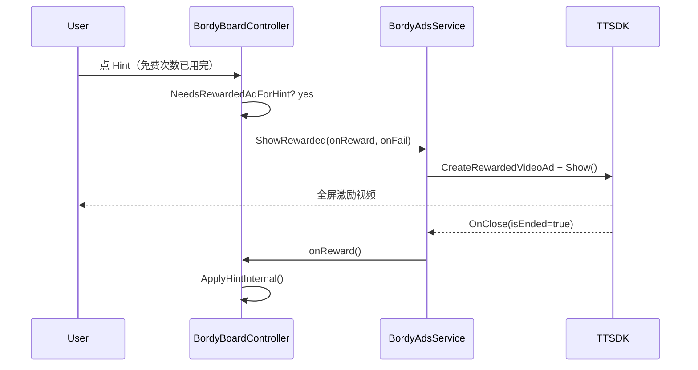

# Bordy 广告接入 — 代码实现详解

TikTok Minis **激励视频**如何接到 Hint 提示，以及可选插屏的实现细节。

相关源码：

| 文件 | 职责 |
|------|------|
| `Assets/Bordy/Scripts/BordyAppConfig.cs` | Ad Unit ID、Editor 模拟开关 |
| `Assets/Bordy/Scripts/BordyAdsService.cs` | TTSDK 广告封装 |
| `Assets/Bordy/Scripts/BordyHintPolicy.cs` | 各关卡免费 Hint 次数 |
| `Assets/Bordy/Scripts/BordyBoardController.cs` | Hint 按钮、扣次数、调广告 |
| `Assets/Bordy/Scripts/BordyUserService.cs` | InitSDK 后 `NotifySdkReady()` |
| `Assets/Bordy/Scripts/BordyStrings.cs` | 广告相关状态文案 |
| `Assets/Bordy/Scripts/BordyMainMenu.cs` | SDK Demo 参考（Legacy，未挂正式场景） |

当前生产配置：

| 项 | 值 |
|----|-----|
| App ID | `7647437535525996565` |
| 激励视频 Ad Unit | `ad7660431701143963669` |
| 配置常量 | `BordyAppConfig.RewardedVideoAdUnitId` |
| 插屏（未申请） | `InterstitialAdUnitId = "demo_interstitial"` |

---

## 1. 产品逻辑

```
玩家点 Hint
    │
    ├─ 棋盘已无错误格可提示 → 状态「没有可提示的格子」
    │
    ├─ 本关仍有免费次数 → 直接填一格正确答案
    │
    └─ 免费次数用完 → 播激励视频
            │
            ├─ 完整观看 (isEnded=true) → 填一格提示
            └─ 提前关闭 / 失败 → 不给提示，底部状态栏提示原因
```

盈利设计：前几关给少量免费 Hint 留住用户；高难度关（`hard` / `brutal`）首次 Hint 即走广告。

---

## 2. 免费 Hint 策略 — BordyHintPolicy

```csharp
public static int ResolveBudget(string levelId, string tier)
{
    if (levelId == TutorialId) return -1;           // 教程：无限，不走广告
    if (IsCampaignId(levelId)) return FreeHintsForTier(tier);
    return 0;                                       // 每日 / 其它：0 次免费
}
```

| 档位 `tier` | 免费 Hint |
|-------------|-----------|
| `easy` / `hook` | 2 |
| `medium` | 1 |
| `hard` / `brutal` | 0 |
| 教程 | 无限（`-1` 表示不扣费、不播广告） |
| 每日挑战 | 0 |

---

## 3. 对局内实现 — BordyBoardController

### 3.1 初始化（Start 内）

```csharp
InitHintBudget();
```

```csharp
if (TryGetEntry(_levelId, out var entry))
    _freeHintBudget = BordyHintPolicy.ResolveBudget(_levelId, entry.Tier);
else
    _freeHintBudget = BordyHintPolicy.ResolveBudget(_levelId, null);
_hintsUsedThisSession = 0;
```

- `_freeHintBudget >= 0`：有上限，用完后走广告。
- `_freeHintBudget == -1`：教程无限 Hint。

### 3.2 Hint() 主流程

```csharp
public void Hint()
{
    if (_won || _reviewMode) return;
    if (!HasHintableCell()) { ... return; }

    if (NeedsRewardedAdForHint())   // _hintsUsed >= _freeHintBudget
    {
        RequestHintViaAd();
        return;
    }

    if (ApplyHintInternal())
        _hintsUsedThisSession++;
}

private bool NeedsRewardedAdForHint()
    => _freeHintBudget >= 0 && _hintsUsedThisSession >= _freeHintBudget;
```

### 3.3 请求广告

```csharp
private void RequestHintViaAd()
{
    if (_hintAdInFlight) return;
    _hintAdInFlight = true;
    SetTransientStatusKey(StatusHintLoadingAd);

    BordyAdsService.ShowRewarded(
        onReward: () => {
            _hintAdInFlight = false;
            if (ApplyHintInternal()) _hintsUsedThisSession++;
            UpdateHintStatus();
        },
        onFail: reason => {
            _hintAdInFlight = false;
            SetTransientStatusKey(MapAdFailReason(reason));
        });
}
```

### 3.4 ApplyHintInternal()

遍历棋盘，找到第一个「非给定格且答案不对」的格子，填入 `Solution` 值，刷新 UI，触发 `EvaluateBoard()`。

### 3.5 通关插屏（可选）

```csharp
if (entry.Tier == "brutal")
    BordyAdsService.TryShowInterstitial();
```

仅 `brutal` 关通关后尝试插屏；ID 仍为 demo 占位时真机直接跳过。

---

## 4. 广告 SDK 封装 — BordyAdsService

### 4.1 前置条件

真机 `ShowRewarded` 检查顺序：

1. 非 Editor
2. `!_rewardedShowing`（防连点）
3. `BordyUserService.SdkInited == true`
4. `IsRewardedConfigured`（Ad Unit 非空且不以 `demo_` 开头）

InitSDK 在 `BordyUserService.BootRoutine` 里完成；成功后调用 `NotifySdkReady()` 打 log。

### 4.2 TikTok SDK 调用约定（与官方 Demo 一致）

**没有 `Load()`**。每次展示：

```csharp
var ad = TT.CreateRewardedVideoAd(new CreateRewardedVideoAdParam {
    AdUnitId = BordyAppConfig.RewardedVideoAdUnitId,
});
ad.OnError += (code, msg) => { ... FailRewarded; ad.Destroy(); };
ad.OnClose += isEnded => {
    ad.Destroy();
    if (isEnded) onReward();   // 只有看完才发 Hint
    else onFail("skipped");
};
ad.Show();
```

- **每次 Show 新建实例**，关闭后 `Destroy()`（与 `BordyMainMenu` Demo 一致）。
- 奖励判定：**仅** `OnClose(isEnded == true)`。

### 4.3 Editor 行为

```csharp
#if UNITY_EDITOR
if (BordyAppConfig.EditorSimulateRewardedAds)
    onReward();           // 模拟看完
else
    onFail("editor_no_sim");  // 默认：提示需真机或开模拟
#endif
```

本地测 Hint 次数逻辑可设：

```csharp
public const bool EditorSimulateRewardedAds = true;
```

### 4.4 插屏 TryShowInterstitial

- 静默失败，不影响游戏。
- 需要真实 `InterstitialAdUnitId`（非 `demo_*`）且 `SdkInited`。

---

## 5. 失败原因与用户文案

| `onFail` reason | 用户看到的 key | 含义 |
|-----------------|----------------|------|
| `editor_no_sim` | `StatusHintEditorBlocked` | Editor 未开模拟 |
| `sdk_not_ready` | `StatusHintSdkNotReady` | InitSDK 未完成 |
| `not_configured` | `StatusHintAdNotConfigured` | Ad Unit 仍是 demo 占位 |
| `skipped` | `StatusHintAdFailed` | 用户提前关闭 |
| `error_*` / 其它 | `StatusHintAdFailed` | 创建/展示失败 |

---

## 6. 端到端时序（真机）



---

## 7. 配置与发布 checklist

1. TikTok 后台 **Monetization** 创建 Rewarded Video，复制 Ad Unit ID。
2. 写入 `BordyAppConfig.RewardedVideoAdUnitId`（当前已填 `ad7660431701143963669`）。
3. **TikTokGame → Build Minigame** → 打 zip → App 扫码预览（Editor 无真广告）。
4. 进闯关第 3/4 关或用完免费 Hint 后点 Hint，确认视频弹出且看完后填格。
5. 查 TTSDK 调试终端：`[BordyAds] Rewarded ad ready (unit=...)`。

---

## 8. 与登录模块的关系

| 能力 | 依赖 |
|------|------|
| 激励视频 Hint | `SdkInited`（InitSDK 成功） |
| 云存档 | `CloudLoggedIn`（Worker 登录） |

两者独立：云登录失败时 Play 可能被 Home 挡住，但已进入对局后 Hint 广告仍依赖 SDK init，不依赖 `CloudLoggedIn`。

详见 [LOGIN-STATE.zh.md](LOGIN-STATE.zh.md)。

---

## 9. 调试清单

| 现象 | 处理 |
|------|------|
| Editor 提示 ad sim is off | 正常；开 `EditorSimulateRewardedAds` 或打真机包 |
| 真机 not configured | 检查 `RewardedVideoAdUnitId` |
| 真机 sdk not ready | 等 Home 加载完再进关；查 InitSDK log |
| 有广告但没 Hint | 是否提前关闭（`isEnded=false`） |
| 完全无填充 | 广告位审核 / 地区；查 `OnError` code |

---

## 10. 扩展建议（未实现）

- 换 Ad Unit：只改 `BordyAppConfig`，重新 Build。
- 增加插屏：后台申请 Interstitial ID，替换 `InterstitialAdUnitId`，可在关卡结算统一调 `TryShowInterstitial()`。
- 激励复用实例：当前按 SDK Demo 每次 Create；若官方建议复用可再封装一层 pool。

参考 Demo：`Assets/Bordy/Scripts/BordyMainMenu.cs` → `DoRewardedAd()` / `DoInterstitialAd()`。
