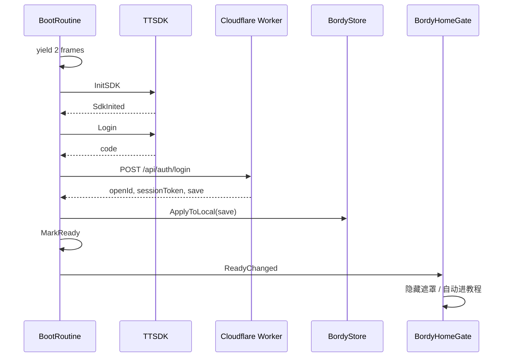

# Bordy 登录状态 — 代码实现详解

身份、云端登录、存档同步、Home 门控的完整实现路径。

相关源码：

| 文件 | 职责 |
|------|------|
| `Assets/Bordy/Scripts/BordyUserService.cs` | 启动编排、状态字段、登录主流程 |
| `Assets/Bordy/Scripts/BordyCloudBackend.cs` | HTTP：code 换 openId、上传存档 |
| `Assets/Bordy/Scripts/BordyCloudSave.cs` | 云存档 DTO、本地 ↔ 云端映射 |
| `Assets/Bordy/Scripts/BordyCloudSync.cs` | 登录后 push 存档 |
| `Assets/Bordy/Scripts/BordyUserProfile.cs` | 本地用户档案 JSON |
| `Assets/Bordy/Scripts/BordyHomeGate.cs` | Home 遮罩 UI |
| `Assets/Bordy/Scripts/BordyNav.cs` | 开始游戏前的二次校验 |
| `cloudflare/bordy-api/src/index.ts` | Worker：换 code、KV 存档、session |

配置：`BordyAppConfig.ApiBaseUrl` → `https://bordy-api.brainless.workers.dev`

---

## 1. 两种运行模式

```csharp
public static bool CloudEnabled =>
    !string.IsNullOrEmpty(BordyAppConfig.ApiBaseUrl) && !Application.isEditor;
```

| 模式 | 条件 | 行为 |
|------|------|------|
| **云端模式** | 真机预览 / 正式包，且配置了 `ApiBaseUrl` | `TT.InitSDK` → `TT.Login` → Worker 登录 → 云存档为准 |
| **离线模式** | Unity Editor，或 SDK/网络失败降级 | 本地 `BordyStore` 生成 GUID 用户，不上云 |

---

## 2. 状态字段一览

全部在 `BordyUserService` 静态属性中，UI 与导航只读这些字段，不直接调 TikTok API。

| 字段 | 类型 | 含义 |
|------|------|------|
| `SdkInited` | bool | `TT.InitSDK` 回调 `code == 0` |
| `CloudEnabled` | bool | 是否走云端链路（见上表） |
| `CloudLoggedIn` | bool | Worker 登录成功，持有 `openId` + `sessionToken` |
| `CloudLoginFailed` | bool | 云端登录失败（但仍可能已 `IsReady`） |
| `IsReady` | bool | **启动流程结束**，Home 可刷新 UI（成功或失败都会 true） |
| `IsNewUser` | bool | 服务器 KV 中首次见到该 `openId` |
| `IsFirstTimePlayer` | bool | `!BordyProgress.TutorialCompleted`（游戏进度，非 TikTok 新账号） |
| `Profile` | `BordyUserProfile` | 本地档案：`userId`、`playCount` 等 |
| `LastCloudError` | string | 最近一次云端错误（调试 / Retry 提示） |
| `ReadyChanged` | event | 状态变化时通知 `BordyHomeGate` |

**注意**：`IsReady == true` **不等于**登录成功。失败时也会 `MarkReady()`，由 `BordyNav` 阻止点 Play。

---

## 3. 启动入口：Boot 与 BootRoutine

### 3.1 Boot() — 只负责触发

```csharp
[RuntimeInitializeOnLoadMethod(RuntimeInitializeLoadType.AfterSceneLoad)]
public static void Boot()
{
    if (_booted) return;
    _booted = true;
    BordyHttpRunner.Run(BootRoutine());
}
```

- Unity 加载任意场景后自动执行一次。
- `_booted` 防止重复启动。
- **`Boot()` ≠ `BootRoutine()`**：Boot 是入口，BootRoutine 是协程本体。

### 3.2 BootRoutine() — 实际流程

```
yield null × 2          // 等容器 / 首帧渲染，避免 InitSDK 过早
│
├─ CloudEnabled?
│    yes → new BordyCloudBackend(ApiBaseUrl)
│
├─ TT.InitSDK(callback)
│    │
│    ├─ 成功 → SdkInited=true
│    │         BordyLocale.ReloadFromStore()
│    │         BordyAdsService.NotifySdkReady()   // 广告侧日志，与登录并行
│    │         BeginCloudOrLocalLogin()
│    │
│    └─ 失败 → FinishOfflineBoot()
│
├─ 等待 sdkDone（超时 12s）→ 超时则 FinishOfflineBoot()
```

---

## 4. 云端登录三步

### 步骤 A：TikTok 静默登录

`BeginCloudOrLocalLogin()` → `SilentLogin()`：

```csharp
TT.Login(
    code => CompleteCloudLogin(code),
    err  => FailCloudLogin(...));
```

- 拿到的是**一次性 `code`**，不是 openId。
- `_loginInFlight` 防止并发重复登录。

### 步骤 B：Worker 换 openId

`BordyCloudBackend.LoginCoroutine`：

```
POST {ApiBaseUrl}/api/auth/login
Body: { "code": "<TT.Login 返回的 code>" }
```

Worker（`index.ts` → `handleLogin`）：

1. `exchangeCode(env, code)` 向 TikTok 换 **openId**
2. 读 KV `user:{openId}` → 无记录则 `isNewUser=true`，写入默认 save
3. `createSession` 签发 **sessionToken**（JWT，后续 PUT 存档用）
4. 响应：`{ openId, sessionToken, save, isNewUser }`

客户端保存：

```csharp
OpenId = wrapper.openId;
SessionToken = wrapper.sessionToken;
```

### 步骤 C：ApplyCloudLogin

```csharp
CloudLoggedIn = true;
IsNewUser = res.isNewUser;

if (res.save != null)
    BordyCloudSave.ApplyToLocal(res.save);

Profile = new BordyUserProfile { userId = res.openId, isAnonymous = false, ... };
SaveProfile();
MarkReady();  // IsReady=true, ReadyChanged 触发
```

**云端存档覆盖本地**（登录时 source of truth = 云）：

| 云字段 | 写入本地 |
|--------|----------|
| `tutorialCompleted` | `BordyProgress` |
| `campaignHighestUnlocked` | `BordyProgress` |
| `daily.*` | `BordyDaily` |
| `locale` | `BordyLocale` |

`ApplyToLocal` 期间 `BordyCloudSync.SuppressPush = true`，避免「刚下载又 upload」循环。

---

## 5. 离线 / 失败降级

### FinishOfflineBoot()

SDK 失败、Editor、或未开云端时：

```csharp
LoadProfileAndReport();  // EnsureProfileLoaded()
MarkReady();
```

`EnsureProfileLoaded()`：

- 读 `BordyStore` 键 `bordy.user.profile`（JSON）
- 无档案 → 新建 `Guid` 作为 `userId`，`isAnonymous=true`，`IsNewUser=true`
- 有档案 → `IsNewUser=false`

此时 `CloudLoggedIn=false`，进度仅存本地。

### FailCloudLogin(error)

```csharp
CloudLoginFailed = true;
CloudLoggedIn = false;
MarkReady();  // 仍设为 ready，让 UI 显示失败 + 重试
```

云端登录协程超时（15s）或 HTTP 错误均走此路径。

### RetryCloudLogin()

Home 点「重试」：

```csharp
CloudLoginFailed = false;
IsReady = false;
ReadyChanged?.Invoke();  // 先显示 loading
BeginCloudOrLocalLogin();  // 重新 TT.Login → Worker
```

---

## 6. UI 门控

### BordyHomeGate（仅 Home 场景）

`BordyUiBootstrap` 进 Home 时 `EnsureOn(canvas)`，订阅 `ReadyChanged`。

| 条件 | UI |
|------|-----|
| `!CloudEnabled` | 无遮罩，Play 可点（Editor） |
| `!IsReady` | 遮罩 +「正在登录…」，Play 禁用 |
| `CloudLoginFailed` | 遮罩 + 失败文案 + Retry |
| 登录成功 | 隐藏遮罩，Play 可点 |
| `CloudLoggedIn && IsFirstTimePlayer` | 0.6s 后自动 `Nav.StartGame()` → Tutorial |

### BordyNav.StartGame()

```csharp
if (CloudEnabled && !IsReady) return;
if (CloudEnabled && CloudLoginFailed) return;

NoteGameEntered();  // playCount++, CloudSync.PushNow()
LoadScene(firstTime ? Tutorial : LevelSelect);
```

---

## 7. 存档同步（登录之后）

| 时机 | 代码 | 行为 |
|------|------|------|
| 登录成功 | `ApplyToLocal` | 云 → 本地（只读入） |
| 点 Play | `NoteGameEntered` → `PushNow` | 本地 → 云 |
| 游戏内改进度 | 各处 `BordyCloudSync.PushNow` / `PushDebounced` | 本地 → 云 |

上传条件：

```csharp
if (!CloudLoggedIn || CloudBackend == null) return;
CloudBackend.PushSave(...);  // PUT /api/save, Authorization: Bearer {sessionToken}
```

`CaptureFromLocal(openId)` 快照：教程、闯关解锁、每日、语言、`playCount`。

---

## 8. 时序图（真机云端模式）



---

## 9. 与广告模块的关系

- 登录（`CloudLoggedIn`）与广告（`SdkInited`）**独立**。
- 广告只需 `TT.InitSDK` 成功；云登录失败不影响 SDK，但 Home 的 Play 会被 `CloudLoginFailed` 挡住。
- `NotifySdkReady()` 在 InitSDK 成功回调里与 `BeginCloudOrLocalLogin()` 同批执行。

详见 [ADS-INTEGRATION.zh.md](ADS-INTEGRATION.zh.md)。

---

## 10. 调试清单

| 现象 | 查什么 |
|------|--------|
| 一直「正在登录」 | `IsReady` 是否卡住；InitSDK / Login 超时 log |
| 失败可 Retry | `LastCloudError`；Worker `/api/auth/login`；TikTok Security 域名 |
| Editor 无云端 | 正常，`CloudEnabled=false` |
| 换机进度不同步 | 是否 `CloudLoggedIn`；PUT `/api/save` 是否 401 |
| 新用户没进教程 | 云存档里 `tutorialCompleted` 可能已是 true |

日志关键字：`[BordyUser]`、`[BordyCloud]`、`BORDY USER (CLOUD)`。
